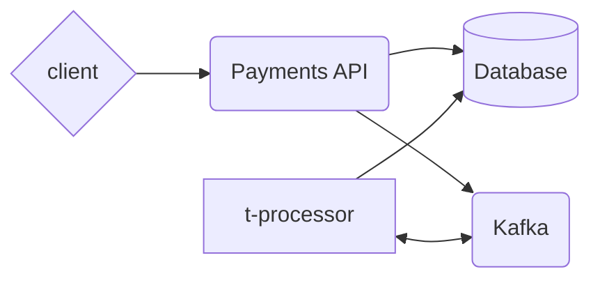

# System Architecture

## High-level Arch. Diagram

## Database - Cassandra

### Overview
- Cassandra is a NoSQL distributed database system designed to handle huge amounts of data without compromising performance or scalability

### Why Cassandra?

#### Scalability
- Cassandra scales horizontally and enables us to add more nodes to the cluster as demand grows. Additionally, you can scale up/down during predicted peak teams to avoid "sprawl"
- It's data center (region aware) aware which makes it a good fit for the cloud

#### Availability
- Cassandra ensures high-availability by replicating data across nodes in the clusters and data centers 

#### Fault tolerance:
- Through cassandras distributed/decentralized architecture it is fault-tolerant by nature we just need to ensure we have the right number of nodes (at least 3) and set the appropriate replication factor.
- Additionally, is considered to not have a single point of failure as it is "master-less". 

#### Write Performance
- Cassandra offers fast write capabilities, which is beneficial for a transaction-heavy system such as a payment system

#### Tunable Consistency
- Provides configurable client support for R/W tunning via consistency levels
    - ALL
    - EACH_QUORUM
    - QUORUM

### Important Configurations

#### Replication Factor
- Replication factor indicates how many nodes need to have a copy of the data. This should be 3 to start. 

#### Consistency Levels
- As mentioned above, clients can tune the consistency levels based the guarantees they would like to achieve. *ALL* provides the highest consistency level as it requires for every node in the cluster to commit to the log and memtable though the higher the consistency level it will impact performance.
- For the transaction updates I used *QUORUM* as the consistency level.

### Deployment Strategy (On GCP)
- During my research I found that there has been significant strides to be able to run Cassandra on GKE/K8s, therefore, I would start there and leverage [k8ssandra](https://k8ssandra.io/blog/announcements/release/k8ssandra-operator-v1-5-0-is-available/).
- The benefits with running Cassandra on GKE are:
    1. We can quickly scale up and down the cluster as needed
    2. Through Node Pool auto-scaling we can dynamically provision new node pools with the required instance type
    3. Cluster upgrade testing becomes easier as we will be able to provision a new cluster in an isolated namespace.
- HA Configurations:
    - We would run 2 clusters in 2 separate regions
    - Additionally, we would ensure that each node with the regional cluster is spread out across the zones using  [topology spread constrints](https://kubernetes.io/docs/concepts/scheduling-eviction/topology-spread-constraints/)
        - This also ensure that we don't bin pack on a single node
- Ingress Configurations
    - GKE Supports dynamic load balancer creating via k8s service annotation which we would need a TCP load balancer
        - Currently GCP doesn't support SNI routing, therefore, it would likely be a pass through load load balancer and we would terminate SSL on the container.

---
## Transactions Processing EventBus - Kafka

### Why Kafka?

#### Scalability
- Kafka is highly available pub/sub distributed event store and streaming platform that is battle tested across the financial sector.

#### Message Ordering
- Kafka provides message ordering guarantees on a topic partition.
- If a producer includes a *key*, using the a key hashing algorithm, the message will always go to the same partition which we can leverage for accounts transaction processing (using the from_account_id as the key)
    - Though I did have concerns with transactions going into another topic, however, that would happen on the to_account_id in which case the balance would be increasing so it's a fair trade off.

#### Cloud native
- Kafka can run on top of kubernetes and has operator support which significantly simplifies the deployment process of the platform

### Important Configurations
- Producer: 
    - Ensure we either pass a *key* or a specific partition for *transactions* topic
- Consumer: 
    - We need to make sure that we handle re-processing in case of failures. By default kafka consumers are configured to "at least once", which means that in case of a failure some messages may be re-processed. However, the alternative which is "at most once", would mean that we could lose a message. 

### Monitoring
- Metrics
    - System:
        - For metrics collection we would leverage GCP Managed Prometheus and start with the [managed collection](https://cloud.google.com/stackdriver/docs/managed-prometheus/setup-managed)
        - Another option is to deploy [OpenTelemetry](https://cloud.google.com/stackdriver/docs/managed-prometheus/setup-otel) which would deployment that we would need to manage but it gives us:
            - Provides the ability to configure multiple backends to route telemetry data to
            - Supports 3 types of signals: metrics, logs, and traces.
            - Supports auto-instrumentation
    - Kafka
        - Since kafka is java based we have to use jmx_exporter to expose the metrics for otel/prometheus to collect
        - Once we the exporter setup we can leverage some of the out the box metrics and alerts to monitor the system such as:
            - KafkaOfflinePartitonCount
            - KafkaUnderReplicatedPartitionCount
            - KafkaUncleanLeaderElection
### Deployment Strategy (On GCP)
- Much like Cassandra, I would opt to run Kafka on a GKE cluster as there is a well documented [architecture/pattern](https://cloud.google.com/kubernetes-engine/docs/tutorials/stateful-workloads/kafka)
- HA Configurations
    - From an infrastructure perspective, same applies to kafka brokers and zookeeper nodes (would try to run the version without it)
        - Topology Spread configurations to reduce bin packing
        - Dedicated TCP load balancer
- Deployment Tool(s)
    - Depending on the DevSecOps budget, I would opt-in for GitOps accross the board
        - Infrastructure provisioning
            - [Config Connector](https://cloud.google.com/config-connector/docs/reference/resource-docs/container/containercluster)
            - If not GCP, [Crossplane.io](https://www.crossplane.io/)
        - GKE Application Deployments:
            - ArgoCD or [GCP Config Sync](https://cloud.google.com/anthos-config-management/docs/config-sync-overview)

---

## API/Processor - Flask + Python

### Overview

#### Project structure
- I leveraged the new standard using [pyproject.toml](https://packaging.python.org/en/latest/guides/writing-pyproject-toml/) to easily managed dependencies and installable scripts.
- There are two scripts defined the project:
    - **fc-payments-api**
        - Runs the Flask API
    - **fc-payments-consumer**
        - Kafka transaction processor/consumer
        - Could be moved to it's own project

#### Docker Compose
- Though I know it wasn't a requirement, I wanted to get a working (not perfect) version of the application, at least locally.
- The docker compose file includes the required/minimally configured middle ware/db. 

### Important Configurations

#### Dockerfile
- In production, you want to ensure that applications do not run as root, therefore, the Dockerfile includes the script required to create the runtime user and switch to it before installing the application

#### Gunicorn
- Python's web framework such as Django and Flask only provide us with a development web server, for production we have to use a WSGI compliant server and have it serve our application.

### API 
#### Usage
- The *fc-payments-ap* is responsible:
    1. Account creation and querying
    2. Transaction querying/Processing invocation
- When a transaction is submited to the API, it validates the account has enough funds to support the transaction then sends the message to a kafka topic for processing

#### Deployment
- This component can run on GKE with multiple instances running behind and ingress controller/reverse proxy
    - In the past i've used Istio Virtual Services as it also gives us mTLS, but others can also work
- Additionally, proper configuration and setup of Kubernetes readiness and liveness probes enables us to rely on the K8s platform and ensure customers are not impacted in the case of a bad deployment
    - This requires setting proper health checks and configuring the workload to properly report when it is ready and healthy
### Transactions Processor

#### Usage
- This components is responsible for updating the database/executing the transaction
    - It would also update the status of the transaction once it has been completed though it is not all implemented.
- It is a consumer group that could be scaled to listen to multiple partitions, however, at the moment it only listens to topic/1 partition.

#### Monitoring
- A key items to monitor for consumer groups are:
    - Kafka consumer group lag
        - Delta between last produced message and last committed message
    - Update on the cassandra side 

## Conclusion
- Overall the architecture is decoupled and each component could be scaled independently
    - Given more time I would:
        - Continue to work on the transaction processing
            - I want to understand better how consumers in a consumer group fail over and how it long that takes
        - Also, I chose cassandra is the only DB but perhaps the Accounts table could be in traditional relational database for better ACID guarantees.
- The code is no where near done, but again, i wanted to get some working to demonstrate my ability get a project up and running relatively quickly while learning new tools/systems.
--- 
[back](../README.md)